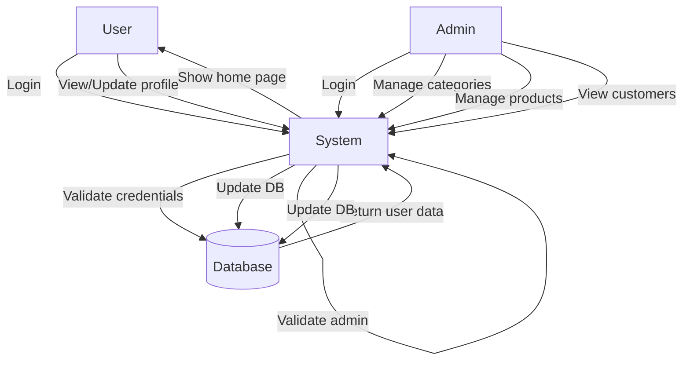
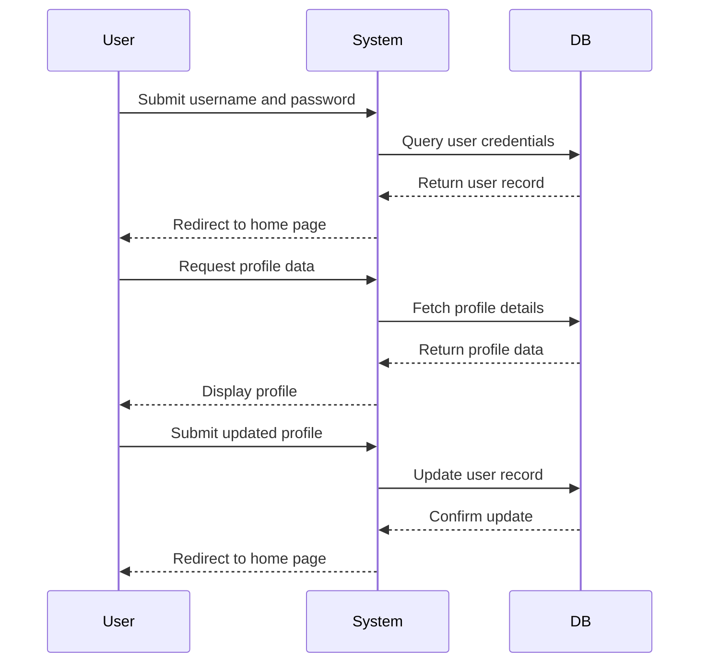
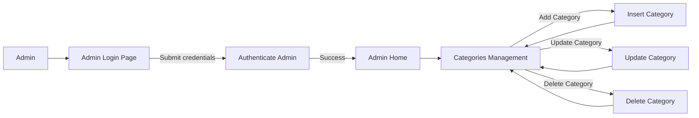

# explain about this document

This document describes the main business processes and rules of the application managing users, admins, products, categories, and customer profiles. It translates the technical implementation into business terms for non-technical stakeholders. The goal is to clarify how users and admins interact with the system, what operations they can perform, and the business policies governing these operations.

We will cover these main questions and design decisions:

1. How do users log in and manage their profiles?
2. How do admins authenticate and manage categories?
3. How do admins manage products (add, update, delete)?
4. How are customer details accessed and updated?
5. What are the key business rules and validation constraints for these operations?

---

# UC-001 | User login and profile management

| Description    | Allows users to log in, view, and update their profile information. |
| -------------- | ------------------------------------------------------------------- |
| Primary Actor  | Registered User                                                     |
| Preconditions  | User must have a valid account with username and password.          |
| Postconditions | User is authenticated and can view or update their profile details. |

### Basic flow

| Step | User actions                       | System actions                                             |
| ---- | ---------------------------------- | ---------------------------------------------------------- |
| 1    | User navigates to login page       | System displays login form                                 |
| 2    | User submits username and password | System verifies credentials against stored user data       |
| 3    | User is authenticated              | System redirects to user home page with username displayed |
| 4    | User views profile                 | System fetches and displays user profile details           |
| 5    | User submits updated profile info  | System updates user data and confirms changes              |

### Alternate flow

| Step | User actions                     | System actions                                                                   |
| ---- | -------------------------------- | -------------------------------------------------------------------------------- |
| 1    | User submits invalid credentials | System shows error message "Invalid Username or Password" and reloads login page |

### Exception flow

| Step | User actions                     | System actions                                                         |
| ---- | -------------------------------- | ---------------------------------------------------------------------- |
| 1    | System encounters database error | System logs exception and returns to login page without authentication |

### Business rules

| Rule ID | Description                                                    |
| ------- | -------------------------------------------------------------- |
| BR-001  | Users must provide valid username and password to log in.      |
| BR-002  | Users can update their username, email, password, and address. |
| BR-003  | Username displayed on home page reflects logged-in user.       |

### Validation rules

| Rule ID | Description                                     |
| ------- | ----------------------------------------------- |
| VR-001  | Username and password fields must not be empty. |
| VR-002  | Email must be in valid email format.            |

### Entities and data model

| Entity | Attributes                                 | Relationships | Validation rules                          | Error messages                 |
| ------ | ------------------------------------------ | ------------- | ----------------------------------------- | ------------------------------ |
| User   | userid, username, email, password, address | None          | Email format, non-empty username/password | "Invalid Username or Password" |

### Validation and testing

| Criteria         | Test scenario                | Test data                                                            | Expected result               |
| ---------------- | ---------------------------- | -------------------------------------------------------------------- | ----------------------------- |
| Successful login | Valid username and password  | username: "user1", password: "pass"                                  | Redirect to user home page    |
| Failed login     | Invalid credentials          | username: "user1", password: "wrong"                                 | Show error message            |
| Profile update   | Submit new email and address | email: "[new@mail.com](mailto:new@mail.com)", address: "New Address" | Profile updated and displayed |

---

# UC-002 | Admin authentication and category management

| Description    | Enables admin login and management of product categories.         |
| -------------- | ----------------------------------------------------------------- |
| Primary Actor  | Admin                                                             |
| Preconditions  | Admin must know valid admin credentials.                          |
| Postconditions | Admin is authenticated and can add, update, or delete categories. |

### Basic flow

| Step | User actions                        | System actions                                 |
| ---- | ----------------------------------- | ---------------------------------------------- |
| 1    | Admin navigates to admin login page | System displays admin login form               |
| 2    | Admin submits username and password | System verifies credentials (hardcoded check)  |
| 3    | Admin is authenticated              | System redirects to admin home page            |
| 4    | Admin views categories page         | System displays categories list                |
| 5    | Admin adds a new category           | System inserts new category into system        |
| 6    | Admin updates or deletes category   | System updates or removes category accordingly |

### Alternate flow

| Step | User actions                      | System actions                                                                   |
| ---- | --------------------------------- | -------------------------------------------------------------------------------- |
| 1    | Admin submits invalid credentials | System shows error message "Invalid Username or Password" and reloads login page |

### Exception flow

| Step | User actions                     | System actions                                                         |
| ---- | -------------------------------- | ---------------------------------------------------------------------- |
| 1    | System encounters database error | System logs exception and redirects to categories page without changes |

### Business rules

| Rule ID | Description                                               |
| ------- | --------------------------------------------------------- |
| BR-004  | Admin login requires username "admin" and password "123". |
| BR-005  | Admin can add categories by specifying a category name.   |
| BR-006  | Admin can update category names by category ID.           |
| BR-007  | Admin can delete categories by category ID.               |

### Validation rules

| Rule ID | Description                                              |
| ------- | -------------------------------------------------------- |
| VR-003  | Category name must not be empty when adding or updating. |

### Entities and data model

| Entity   | Attributes       | Relationships | Validation rules        | Error messages                  |
| -------- | ---------------- | ------------- | ----------------------- | ------------------------------- |
| Category | categoryid, name | None          | Non-empty category name | "Category name cannot be empty" |

### Validation and testing

| Criteria               | Test scenario                  | Test data                              | Expected result             |
| ---------------------- | ------------------------------ | -------------------------------------- | --------------------------- |
| Successful admin login | Correct admin credentials      | username: "admin", password: "123"     | Redirect to admin home page |
| Add category           | Valid category name            | categoryname: "Electronics"            | Category added and listed   |
| Update category        | Valid category ID and new name | categoryid: 1, categoryname: "Gadgets" | Category updated            |
| Delete category        | Valid category ID              | categoryid: 1                          | Category removed            |

---

# UC-003 | Admin product management

| Description    | Allows admin to add, update, and delete products.       |
| -------------- | ------------------------------------------------------- |
| Primary Actor  | Admin                                                   |
| Preconditions  | Admin must be logged in.                                |
| Postconditions | Products are created, updated, or deleted as requested. |

### Basic flow

| Step | User actions              | System actions                                         |
| ---- | ------------------------- | ------------------------------------------------------ |
| 1    | Admin views products page | System displays product list                           |
| 2    | Admin adds a product      | System inserts product with details including category |
| 3    | Admin updates a product   | System updates product attributes by product ID        |
| 4    | Admin deletes a product   | System removes product by product ID                   |

### Alternate flow

| Step | User actions                                  | System actions                         |
| ---- | --------------------------------------------- | -------------------------------------- |
| 1    | Admin attempts to update non-existent product | System shows error or no update occurs |

### Exception flow

| Step | User actions                     | System actions                                                       |
| ---- | -------------------------------- | -------------------------------------------------------------------- |
| 1    | System encounters database error | System logs exception and redirects to products page without changes |

### Business rules

| Rule ID | Description                                                                                       |
| ------- | ------------------------------------------------------------------------------------------------- |
| BR-008  | Products must be linked to an existing category.                                                  |
| BR-009  | Admin can update product details including name, image, quantity, price, weight, and description. |
| BR-010  | Admin can delete products by product ID.                                                          |

### Validation rules

| Rule ID | Description                                                                 |
| ------- | --------------------------------------------------------------------------- |
| VR-004  | Product name, category, and price must be provided when adding or updating. |
| VR-005  | Quantity, price, and weight must be positive numbers.                       |

### Entities and data model

| Entity  | Attributes                                                        | Relationships                    | Validation rules                                        | Error messages         |
| ------- | ----------------------------------------------------------------- | -------------------------------- | ------------------------------------------------------- | ---------------------- |
| Product | id, name, image, categoryid, quantity, price, weight, description | Linked to Category by categoryid | Non-empty name, valid category, positive numeric fields | "Invalid product data" |

### Validation and testing

| Criteria       | Test scenario                    | Test data                                          | Expected result            |
| -------------- | -------------------------------- | -------------------------------------------------- | -------------------------- |
| Add product    | Valid product details            | name: "Phone", category: "Electronics", price: 500 | Product added successfully |
| Update product | Valid product ID and new details | id: 1, name: "Smartphone", price: 550              | Product updated            |
| Delete product | Valid product ID                 | id: 1                                              | Product deleted            |

---

# UC-004 | Customer details display

| Description    | Allows viewing of customer details by admin. |
| -------------- | -------------------------------------------- |
| Primary Actor  | Admin                                        |
| Preconditions  | Admin must be logged in.                     |
| Postconditions | Customer details are displayed.              |

### Basic flow

| Step | User actions                             | System actions                                       |
| ---- | ---------------------------------------- | ---------------------------------------------------- |
| 1    | Admin navigates to customer details page | System fetches and displays customer list or profile |

### Business rules

| Rule ID | Description                                                                       |
| ------- | --------------------------------------------------------------------------------- |
| BR-011  | Admin can view customer details including username, email, password, and address. |

### Validation rules

| Rule ID | Description                     |
| ------- | ------------------------------- |
| VR-006  | None specific to this use case. |

### Entities and data model

| Entity | Attributes                                 | Relationships | Validation rules | Error messages |
| ------ | ------------------------------------------ | ------------- | ---------------- | -------------- |
| User   | userid, username, email, password, address | None          | None             | None           |

### Validation and testing

| Criteria                 | Test scenario                   | Test data         | Expected result            |
| ------------------------ | ------------------------------- | ----------------- | -------------------------- |
| Display customer details | Admin requests customer profile | username: "user1" | Customer details displayed |

---

# Business rules summary

| Use Case | Rule ID | Description                                                                                       |
| -------- | ------- | ------------------------------------------------------------------------------------------------- |
| UC-001   | BR-001  | Users must provide valid username and password to log in.                                         |
| UC-001   | BR-002  | Users can update their username, email, password, and address.                                    |
| UC-001   | BR-003  | Username displayed on home page reflects logged-in user.                                          |
| UC-002   | BR-004  | Admin login requires username "admin" and password "123".                                         |
| UC-002   | BR-005  | Admin can add categories by specifying a category name.                                           |
| UC-002   | BR-006  | Admin can update category names by category ID.                                                   |
| UC-002   | BR-007  | Admin can delete categories by category ID.                                                       |
| UC-003   | BR-008  | Products must be linked to an existing category.                                                  |
| UC-003   | BR-009  | Admin can update product details including name, image, quantity, price, weight, and description. |
| UC-003   | BR-010  | Admin can delete products by product ID.                                                          |
| UC-004   | BR-011  | Admin can view customer details including username, email, password, and address.                 |

---

# Integration requirements

| Integration aspect    | Description                                                                                        |
| --------------------- | -------------------------------------------------------------------------------------------------- |
| Database connectivity | Application connects to a MySQL database to retrieve and update user, product, and category data.  |
| Authentication        | User and admin authentication is handled internally with database checks or hardcoded credentials. |
| Data exchange         | Data is exchanged between the web interface and backend via HTTP requests with form parameters.    |
| Protocols             | Uses HTTP/HTTPS for web communication.                                                             |

---

# Use case dependencies

|                                              | User login and profile management | Admin authentication and category management | Admin product management | Customer details display |
| :------------------------------------------: | :-------------------------------: | :------------------------------------------: | :----------------------: | :----------------------: |
|       User login and profile management      |                 X                 |                                              |                          |                          |
| Admin authentication and category management |                                   |                       X                      |             X            |             X            |
|           Admin product management           |                                   |                       X                      |             X            |                          |
|           Customer details display           |                                   |                       X                      |                          |             X            |

---

# Use case to data entity dependencies

|                   Use Case                   | User | Category | Product |
| :------------------------------------------: | :--: | :------: | :-----: |
|       User login and profile management      |   X  |          |         |
| Admin authentication and category management |      |     X    |         |
|           Admin product management           |      |     X    |    X    |
|           Customer details display           |   X  |          |         |

---

# Functional flow diagram

---

# Sequence diagram for user login and profile update

---

# Flow diagram for admin category management

This document captures the core business processes and rules extracted from the codebase, focusing on user and admin interactions with authentication, profile, categories, products, and customer data. It avoids technical jargon and validation details in business rules, providing a clear view for business stakeholders.&nbsp;

<SwmMeta version="3.0.0" repo-id="Z2l0aHViJTNBJTNBRWNvbW1lcmNlLVNwcmluZ0Jvb3RQcm9qZWN0JTNBJTNBdW1hbGluZ2Fzd2FtaQ==" repo-name="Ecommerce-SpringBootProject">Powered by [Swimm](https://app.swimm.io/)</SwmMeta>
